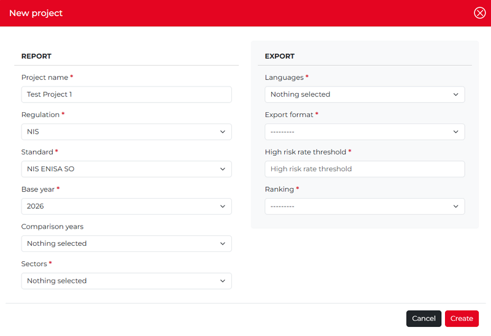

What is a Project?
---------------------

To create reports, you first need to create a **project**. A project defines the scope of a report by specifying a set of criteria used to preselect 
one or more operators. Based on these criteria, the system identifies the operators that match the conditions and includes them in the report.

In other words, a project acts as a filter that determines which operators' data will be collected and analyzed. 
The resulting report can then be generated, downloaded, and reviewed.

The criteria defined in the New Project pop-up determine which operators are included in the project. 
Only companies (operators) that meet the selected conditions will be part of the resulting report.
The project configuration is not permanent. After a project has been created, you can modify the selection criteria 
at any time using the Edit Project function.

Create a new project
~~~~~~~~~~~~~~~~~~~~~

Click the New project button in the top-right corner. The New project pop-up window appears. 
Enter a name for the project, then select the applicable Regulation and Standard. The selected standard is linked to the chosen security objective.

Project name, Regulation, Standard 
^^^^^^^^^^^^^^^^^^^^^^^^^^^^^^^^^^^^

Base year, Comparison years
^^^^^^^^^^^^^^^^^^^^^^^^^^^^^^^^^^^^

Next, select the **Base year**, which serves as the reference year for the report. 
Data from this year will be compared with data from the selected **Comparison years** to provide a historical view of performance and progress over time.

You can select comparison years individually by using the checkboxes next to each year, or select all available years at once 
(by using the **Select all** checkbox).

Sectors
^^^^^^^^^^^^^^^^^^^^^^^^^^^^^^^^^^^^

Use this drop-down menu to select the sectors you want to analyze in the report. 
You can select one or more sectors, either at the category level or individually.
To display the sectors within a category, click the downward-pointing arrow next to the category name. 
The category will expand, allowing you to select specific sectors. 
If you select more than one sector, they will be shown in the **Sectors** dropdown separated by a comma (highlighted in green in the screenshot below).

