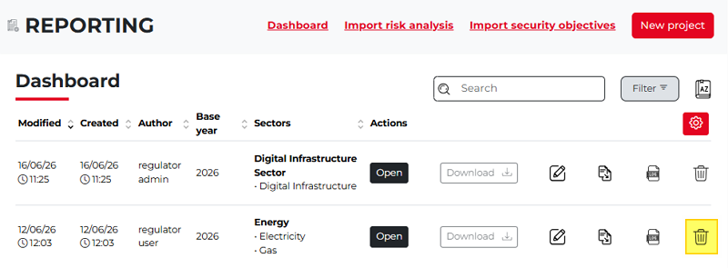
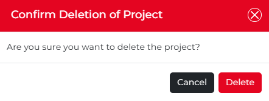
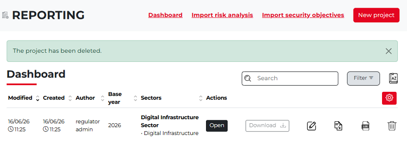

Delete a project
--------------------

If you want to delete a project, locate the project in the list and click its **trash can icon** on the right, among the action icons.
Since the second project does not contain any data and we do not need it anymore, it can be deleted:

The **Confirm Deletion of Project** pop-up window appears.

Once the deletion is confirmed, the project disappears from the project list. 
A confirmation message is also displayed above the table, indicating that the project has been successfully deleted.

