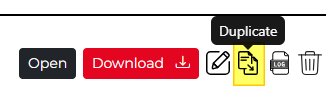
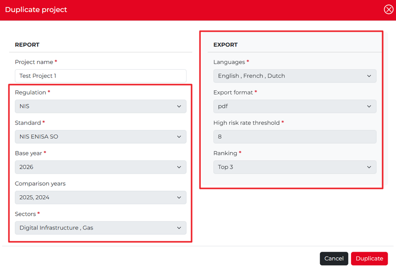

Duplicate a project
---------------------

Once a report has been created, it can be duplicated. Click the **Duplicate** icon among the Action icons to duplicate the report.  

The **Duplicate project** popup appears. In this case, only the Project name field can be modified. 

Once changed, click the Duplicate button in the lower right-hand corner of the popup. 
The duplicated report appears on the dashboard with a name (and copy ) afterwards.
