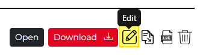
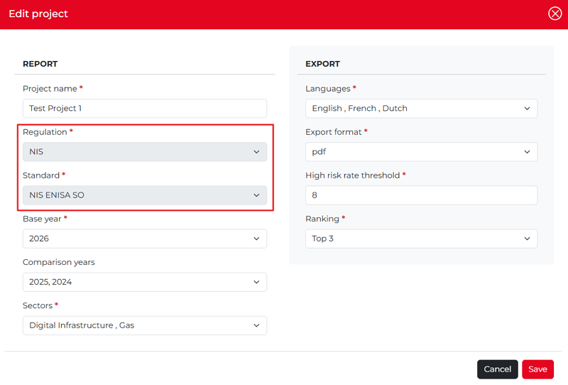

Edit a project
---------------------

Once a report has been created, it can be edited. You can edit a project in two ways. 
The easiest way is to click the **Edit** icon among the **Action icons** to edit the report.  

Alternatively, you can first open a project and then click the **Edit Project** button in the lower-left corner. Either way, the **Edit Project** dialog window will appear. 
You can modify all fields except **Regulation** and **Standard**, which cannot be changed after the project has been created.

