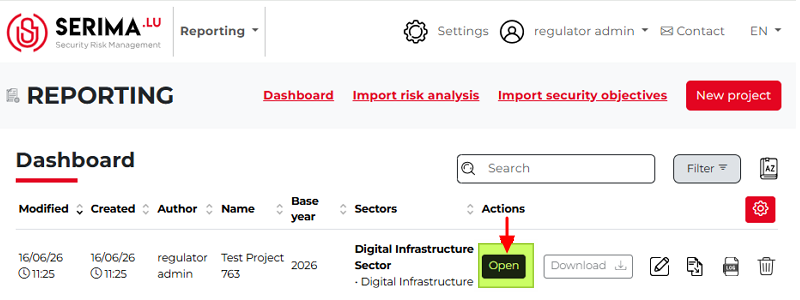
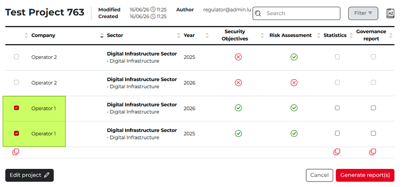
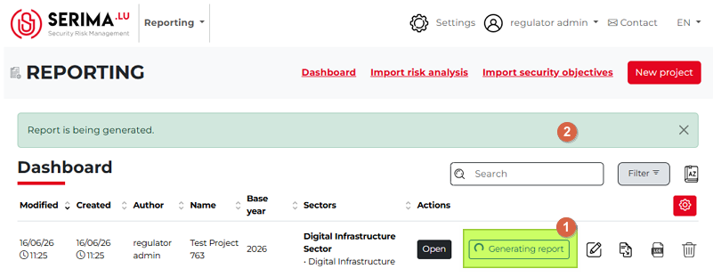
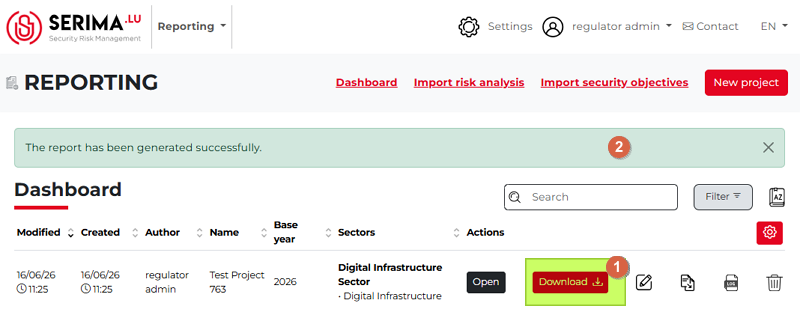
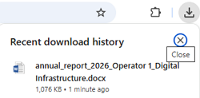

Generate a report
------------------------

To generate a report, first you need to open it. Click the **Open** button of the relevant project on the Dashboard to open it. 

Once the project is open, you can view the companies (operators) involved, the sector they belong to, the reporting year, and whether a **Security Objective** and **Risk Assessment** have been assigned to each operator.

You cannot generate a report for an Operator if either the **Security Objectives** or the **Risk Assessment** is missing. Missing requirements are indicated by a red cross in the corresponding column. A report can only be generated for Operators that have both a valid Security Objectives entry and a Risk Assessment, indicated by green checkmarks in both columns. 

Because of the above, only Operator 1 can be selected in the screenshot below for report generation.

On this screen, you can edit the project by clicking **Edit Project** in the lower-left corner, return to the Dashboard by clicking **Cancel** on the right, or generate a report by clicking **Generate Report(s)** on the far right.

When you click **Generate reports**, you will be directed back to the Dashboard while the message **Generating report** becomes visible next to the Open button. While this is happening, a message **Report is being generated** can be seen above the reports table on the Dashboard. 

Until the process is complete, you can click the **Stop Generating** button to stop report generation.

Once the report has been generated, the **Generating Report** button is replaced with **Download**, and the button color turns red. If the process finishes without any issues, the green message at the top of the table **The report has been generated successfully** is shown. 

Download a report
------------------------

Once you have generated a report, you can download it by clicking the red **Download** button right next to the **Open** button.
The report is downloaded as a Word document and can be opened afterward.

When multiple operators are involved, multiple reports are generated. The reports use different colors according to the palette configuration set during setup (first, second, and third positions). 

The colors of the security objectives in the report are also based on the settings defined during report creation (green, yellow, orange, and red).
