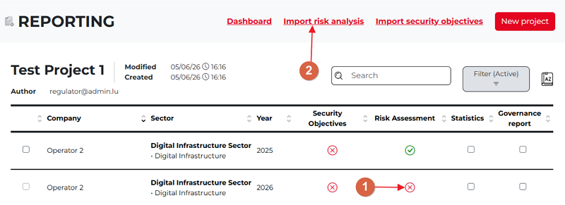
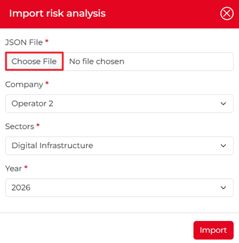
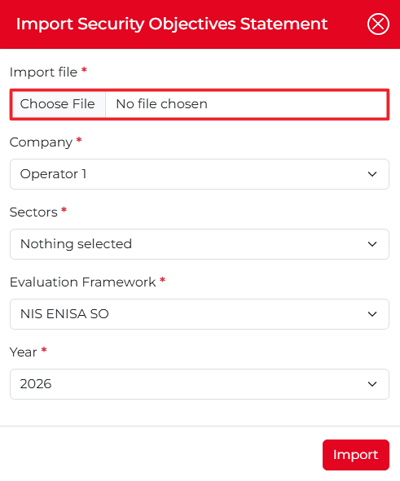
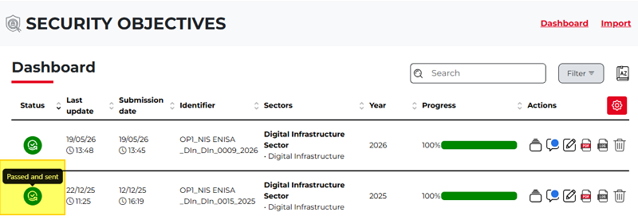

Import Risk Analysis
---------------------

If an operator does not have a **Risk assessment** (there is a red cross in the relevant column for a certain year), the regulator can import a risk assessment either by clicking the red cross icon (1) or choosing the **Import risk analysis** link above the project table (2). 

Either way, the **Import risk analysis** popup appears, where the regulator can choose a JSON file for the risk analysis. 

If the import is successful, the red cross will be replaced in the project table with a green checkmark (indicating that for that year the chosen operator has a risk assessment attached to the report).

Import Security Objectives
~~~~~~~~~~~~~~~~~~~~~~~~~~~~~

You can import security objectives in two ways.

1.	You can choose a table cell (the relevant column of the operator for a certain year), where you can see a red cross icon. Once you click the icon, the **Import Security Objectives Statement** popup window appears. In this case, the chosen operator, sectors, and other fields will be pre-selected.

2.	You can use the link **Import security objectives** above the report table. In this case, the **Import Security Objectives Statement** popup window appears, but the fields will not be pre-selected (you can import security objectives for any of the operators).

To import a security objective, select an Excel file (not a JSON file). Only security objectives with the status **Passed and Sent** can be exported from the project. To verify this, go to the **Security Objectives** module and review the list of security objectives and their current statuses.

All other statuses will not be included in the reporting module because, for statistics and analysis, the regulator can be considered only validated data. 

