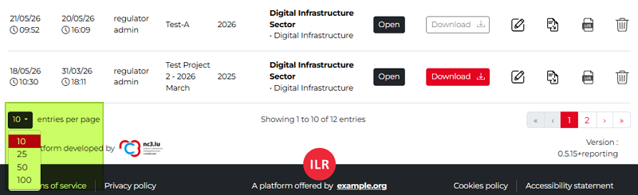
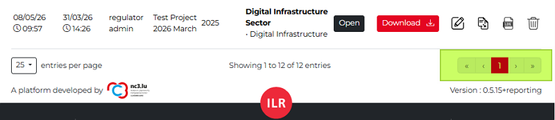
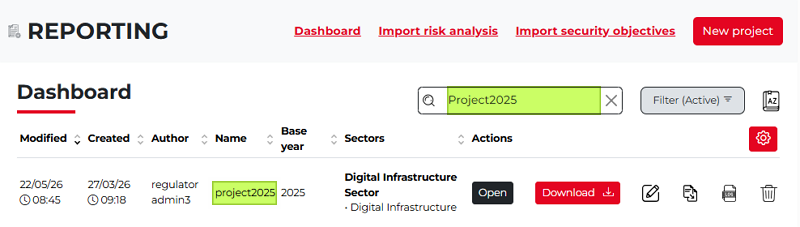
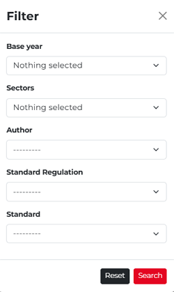
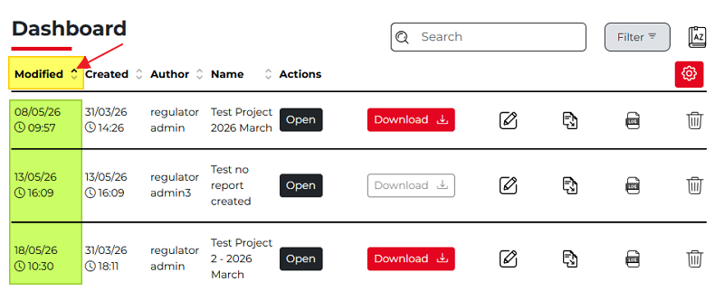
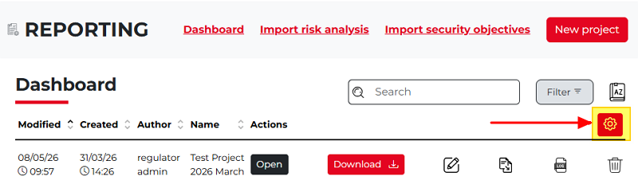

Managing the Dashboard
--------------------------

This chapter summarizes methods for viewing, managing, and searching projects on the Dashboard, helping you navigate them quickly, especially when working with a large number of projects.

Entries per page
~~~~~~~~~~~~~~~~~~~~~

By default, the Dashboard table displays 10 projects. If you have more projects, you can open the drop-down menu and select a higher value (such as 25, 50 or 100) to view more projects on one screen.

The screenshot above shows that 12 projects are displayed across two pages, so you need to switch between pages to access the last two. 
To avoid that, you can set the **Entries per page** value to 25 so that all projects are displayed on a single Dashboard page, keeping them visible and easy to track.

Navigate between Dashboard pages
~~~~~~~~~~~~~~~~~~~~~~~~~~~~~~~~~
  
Despite changing the **Entries per page** value, you may not be able to display all projects on a single page, especially if you have more than 100 projects. 
In this case, you can use the navigation buttons in the lower-right corner of the Dashboard to move forward and backward between pages.

Search among projects
~~~~~~~~~~~~~~~~~~~~~~~~~~~~~~~~~

Another useful feature is the free-text search field (**Search**), which is located above the project table on the Dashboard, to the left of the **Filter** option. 
This is particularly recommended when you have many projects, as it enables you to search for specific keywords across your projects.

Click the **X** icon to the right of the Search field to clear the search criteria and return to the full Dashboard view.

Filter projects
~~~~~~~~~~~~~~~~~~~~~~~~~~~~~~~~~

Click the **Filter** button next to the Search field to open a pop-up window where you can filter your projects by base year, sector, author, regulatory standard, or standard.

Sort projects
~~~~~~~~~~~~~~~~~~~~~~~~~~~~~~~~~

On the Dashboard, you can sort the columns by clicking the up- or down-pointing arrows beside each column header. The arrow indicates whether the order is ascending or descending, allowing you to sort both the column values and the projects accordingly.
Only one sorting criterion can be applied at a time, meaning sorting is active in just one column, either ascending or descending.

In the screenshot below, the projects are sorted by their last modification date. The upward-pointing triangle icon in the **Modified** column shows that the most recently modified projects are displayed at the top, in descending chronological order, with older projects below.

Column Settings
~~~~~~~~~~~~~~~~~~~~~~~~~~~~~~~~~

By default, all columns are displayed on the dashboard. To hide a column or change which columns are shown, click the **Column Settings** icon, which is a white gear icon on a red background above the project board on the right side. 

Clicking the icon opens the **Choice of columns** pop-up, showing all available columns. 
A checkmark in front of a column name indicates that the column is currently displayed. 
To hide a column, simply remove the checkmark next to the relevant column name.

.. figure:: ../_static/reporting_module_images/Rep_07.png
   :alt: Choice of columns
   :target: ../_static/reporting_module_images/Rep_07.png

For example, if most of your reports are related to the same sector and the same base year, displaying these columns may not be necessary. 
Hiding them can make the report list on the dashboard cleaner and easier to understand. 
Once you uncheck a checkbox, the relevant column immediately disappears from the dashboard. 

