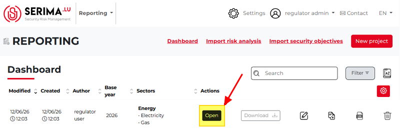
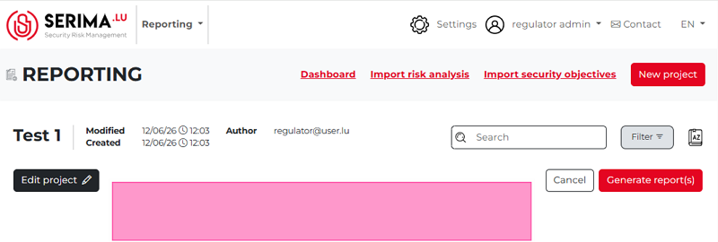
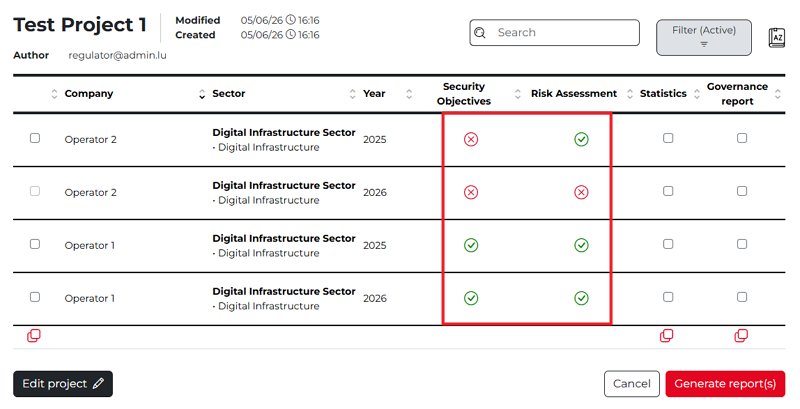

Open a project
---------------------

You can open a project by clicking the **Open** button next to the desired project. This allows you to view the project's details and contents.
If the **Download** button is grayed out, the project may be empty. In such cases, open the project to verify its contents and review the project details.

After clicking **Open**, it becomes clear that the project is indeed empty:

If a project is not empty, there are operators to show as per the settings provided during the project setup, and the project will show the relevant operators (in the **Company** column). The project is shown in a table format displaying the project details. 

The table provides information about the operator (company), the sector(s) involved, the relevant year, and whether the project includes security objectives and risk assessment data.
A **green checkmark** indicates that the project contains the corresponding type of data, while a **red cross** indicates that the data is not available in the project.

**If an operator does not have a security objective in the system for a certain year, a red cross icon will be shown. If the Operator has a             security objective, then a green checkmark is shown.**

Once you create a project, you can edit, duplicate or delete it.

