Back-end Reporting Configuration
---------------------------------

Each regulation requires a single configuration that is linked to the corresponding regulator. 

  **As a Regulator Admin, you can set up the configuration of the reports in the administration interface (back-end) of the SERIMA platform.**

Log in as a Regulator Admin, go to the administration interface, and select Configurations in the Reporting section.

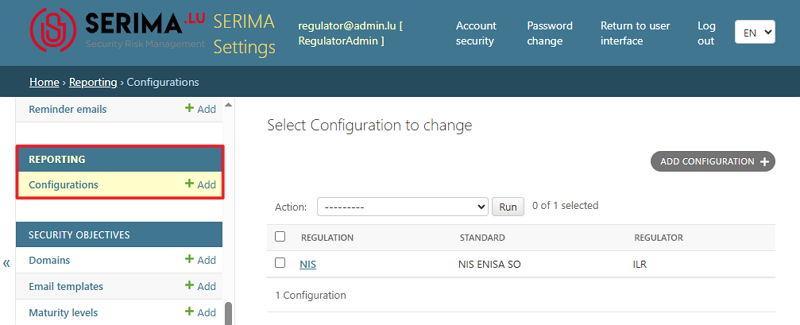

In SERIMA, a Security Objective statement must be created for each operator.

 **Reporting is linked to Security Objectives and the Risk Analysis from MONARC. To generate a report document, you must first create the report   elements.**

Add configuration
~~~~~~~~~~~~~~~~~~~~~~~~~

You can create a new configuration either by clicking the **Add** link next to Configurations, or from the **Select Configuration to change** screen, selecting the **Add Configuration** button. 

 **Configure reporting settings for each Security Standard. First, choose the standard you want to use.**
 **Next, upload a DOCX template to the platform, and finally add colors to the reporting configuration.** 

When generating the report, you can also define the order of the colors used.

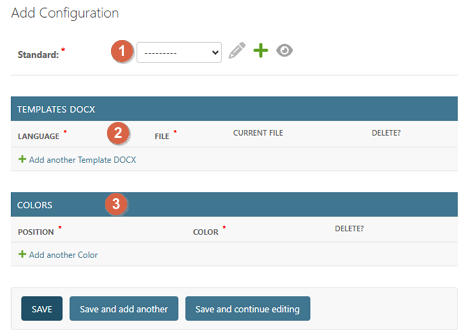

**Standard**
^^^^^^^^^^^^^^^^^^^^^

From the **Standard** dropdown menu, select a standard. Once you have selected a standard, you can use the **Action icons** to the right of the dropdown menu to manage it:

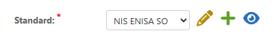

•	**Change the selected standard** 	– Click the pencil icon to choose a different standard.
•	**Add another standard** – Click the green plus (+) icon to add an additional standard.
•	**View the selected standard** 	– Click the eye icon to open the selected standard. 

You will be redirected to the **View Standard** page for that standard.

**Templates docx**
^^^^^^^^^^^^^^^^^^^^^

Templates are DOCX files. The application supports four languages, allowing you to create templates in **English (EN), French (FR), Dutch (NL)**, and **German (DE)**. 

 **A DOCX Template must be provided for each supported language.**

In the **Templates (DOCX)** section, you can manage your DOCX templates. Select the language for your template, click **Choose File**, and upload your DOCX template.

You can add multiple templates to your configuration, for example by uploading templates in different languages.

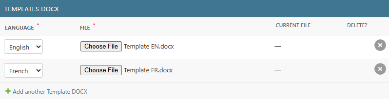

**Colors**
^^^^^^^^^^^^^^^^^^^^^

Finally, you can configure the colors used in your report to represent different maturity levels. 

When you set up a maturity level, the **Color** field is mandatory. Although this field is not used in the **Security Objectives** module, it is required for the **Reporting** module. On the **Select Maturity Level to change** screen, you can view the color and the label for the color used in the **Reporting** module.

Define a **color palette** used in chart series. By default, the following palette is applied:

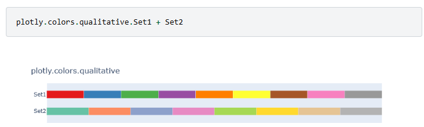

First, select the color position you want to edit. Then, use the color picker: drag the slider to adjust the color range and click within the palette to select your desired color.

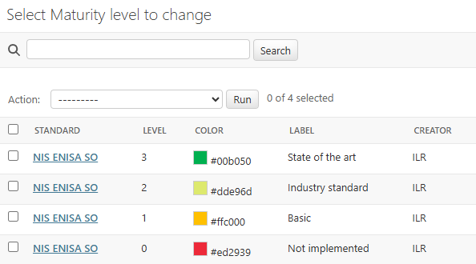

Below the color picker, you can see the selected color and its hexadecimal color code. If you already know the hexadecimal code of the color you want to use, you can enter it directly into the field. A preview of the selected color is displayed next to the hexadecimal code.

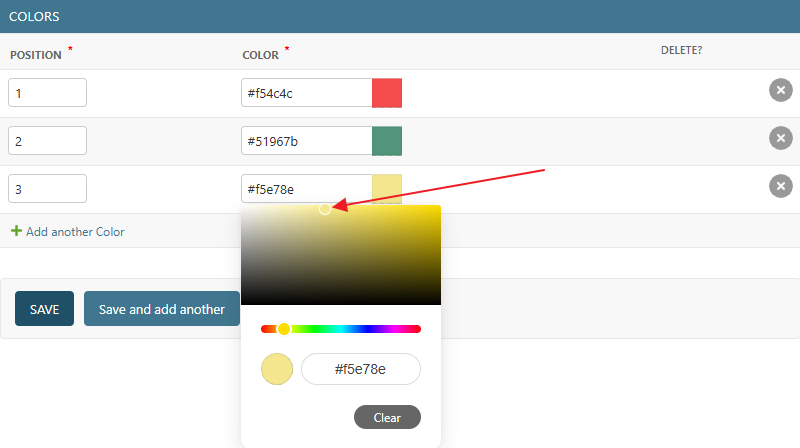

These colors are important because they are used when creating and downloading a report; they define how information is displayed in the report.

Once everything is configured, click **Save**. The newly created configuration will then appear in the **Select Configuration to Change** screen.

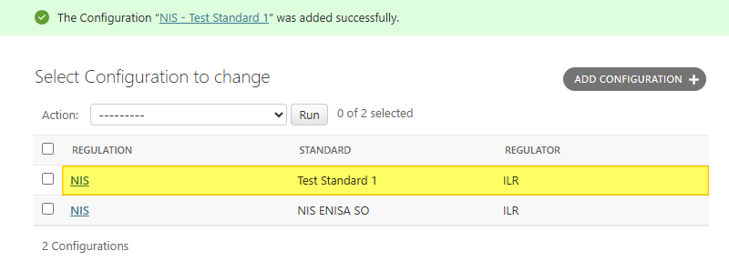

How to download a template?
~~~~~~~~~~~~~~~~~~~~~~~~~~~~~~

Once you have set up and saved a report configuration, you can download the templates by clicking the appropriate **Download** link.

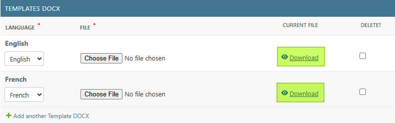

How to delete a template?
~~~~~~~~~~~~~~~~~~~~~~~~~~~~~~

Once you have set up and saved a report configuration, you can delete a template by selecting the checkbox in the **Delete** column for the relevant **template**.

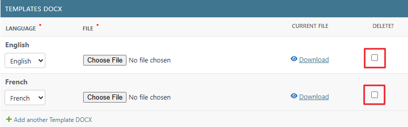

How to delete colors?
~~~~~~~~~~~~~~~~~~~~~~~~~~~~~~

Once you have set up and saved a report configuration, you can delete a color by selecting the checkbox in the **Delete** column for the relevant **color**.

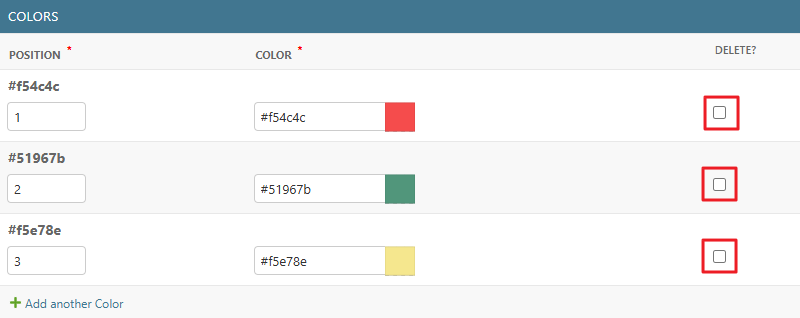

To delete a Color, check the relevant checkbox and click **Save**

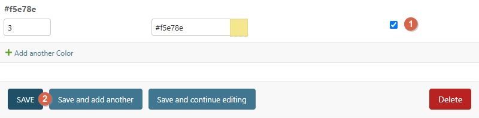

The message **"The configuration <configuration name> was changed successfully."** appears at the top of the **Select Configuration to Change** screen. If you open the same configuration again, the deleted color is no longer displayed.

These colors are important because they are used when creating and downloading a report; they define how information is displayed in the report. Since the yellow color has been deleted, only the green and red colors are displayed in the example below (the screenshot is an example from a printout report):

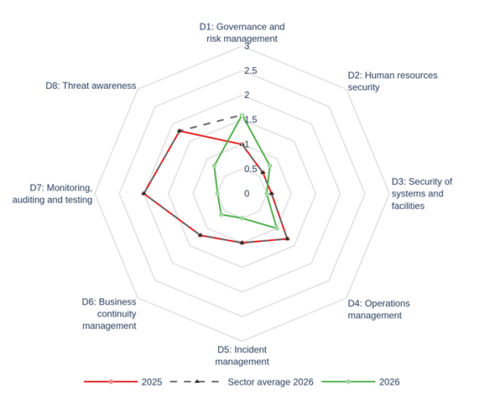
