The Reporting Dashboard
~~~~~~~~~~~~~~~~~~~~~~~~~~~~
  
The **Reporting Dashboard** serves as the central hub for managing all reports. From this screen, you can create, view, edit, and manage reports, as well as monitor their status and access reporting-related information.

Due to the complexity of the screen, its different parts will be presented one by one, with numbered sections describing the functionality of each. 

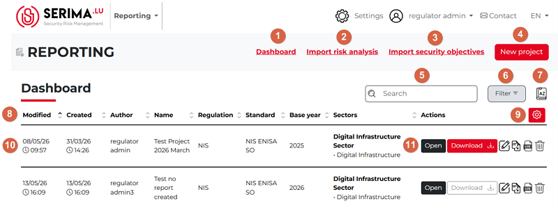

1.  **Dashboard**: To return to the Reporting Dashboard from any page within the Reporting Module, click the **Dashboard** link located at the top of the screen.
2.	**Import risk analysis**: you can import a risk analysis to your reports. If you click this link, the Import risk analysis pop-up appears, so you can import the JSON file for a certain company (operator) for certain sector(s) and for a certain year:

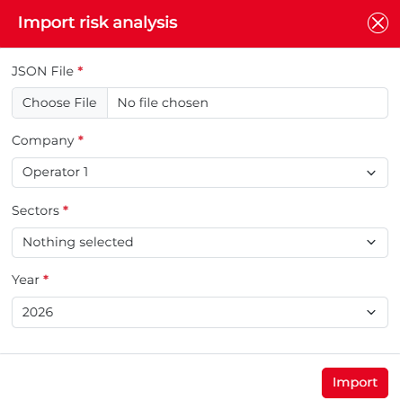

3.	**Import security objectives**: you can import a security objective to your reports. Clicking this link opens the **Import Security Objectives Statement** pop-up window. From here, you can upload a Security Objectives Statement as an Excel file by selecting the relevant company, sector(s), evaluation framework, and year. Once the required information has been provided, you can proceed with the import. 

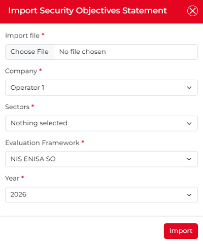

4.	**New project**: As the name suggests, you can start a new project by clicking this button. Clicking the button opens the **New Project** pop-up window, where you can configure and create a new project. Since this pop-up contains several options and features, its functionality will be described in detail later.

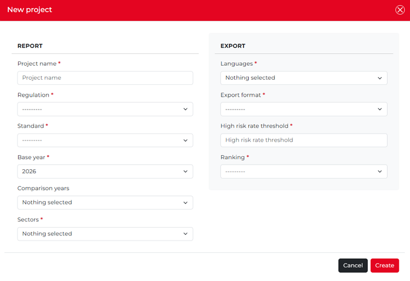

5.	**Search**: The search function is particularly useful when there are many reports available. It allows you to filter reports based on various criteria, making it easier to locate the specific report you are looking for.

6.	**Filter**: You can search among your reports by Base year, Sectors, Author, Standard Regulation, and Standard.

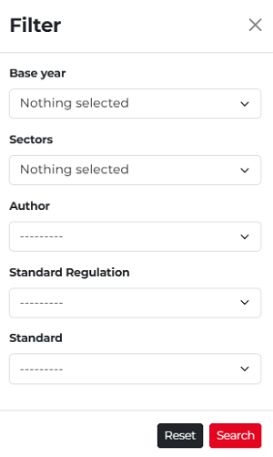

7.	**Icon guide**: The **Icon Guide** is represented by a book-shaped icon labeled **AZ**. Clicking this icon displays the legend above the report list.

8.	**Dashboard table column headings**: The header displays key information about the report, including when it was created (Created) and last modified (Modified), the report author (Author), the project name (Name), the applicable regulation (Regulation), the selected standard (Standard), the reference year used for reporting (Base Year), and the selected sectors.

The **Base Year** serves as the reference point for historical comparisons. Data from this year is compared with data from the selected related years, providing a historical view of performance and progress over time.

9.	**Column settings**: By default, all columns listed in point eight (above) are displayed on the dashboard. To hide a column or change which columns are shown, click the **Column Settings** icon, which is a white gear icon on a red background. 

Clicking the icon opens the **Choice of columns** pop-up, showing all available columns. A checkmark in front of a column name indicates that the column is currently displayed. To hide a column, simply remove the checkmark next to the relevant column name.

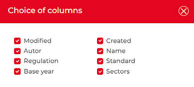

For example, if most of your reports are related to the same sector and the same base year, displaying these columns may not be necessary. Hiding them can make the report list on the dashboard cleaner and easier to understand. Once you uncheck a checkbox, the relevant column immediately disappears from the dashboard. 

In the example below, the **Regulation** and the **Standard** columns were hidden (since the values were always NIS as the regulation, and NIS ENISA SO as the standard). As a result, only the columns with varying values remain visible:

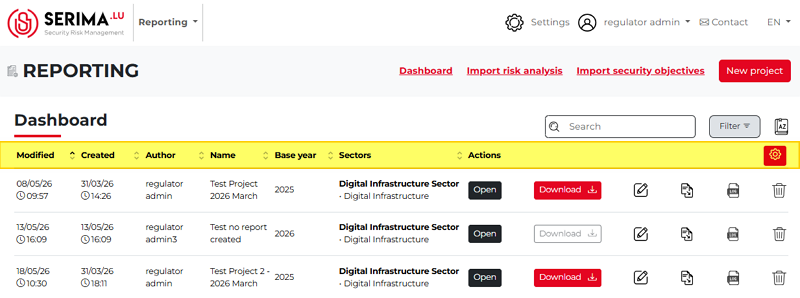

10.	**Report data**: the table rows show the data of the report (when it was created, modified, by whom it was created, the name, base year, etc.).

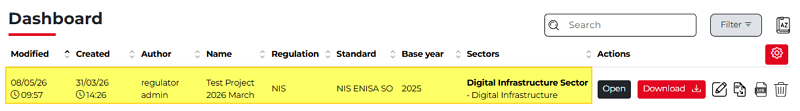

11.	**Action icons**: On the Dashboard, each report has a set of action icons displayed on the right-hand side. These icons provide quick access to the available report actions, which are described below:

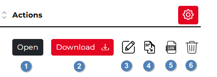

1.	Open: You can open the relevant report by clicking the Open button.
2.	Download: You can download the report.
3.	Edit: You can edit the selected report.
4.	Duplicate: You can duplicate the selected report.
5.	Access Log: For each report, the access log displays all activities that occurred during the report’s lifecycle. If you hover your mouse over the Log icon (highlighted in yellow in the screenshot below), a tooltip labeled Access log will appear. 

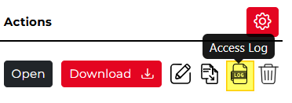

Clicking the icon opens the Access log pop-up window with the columns **Date, Entity, User, Role**, and **Action**. You can sort the columns by clicking the up- or down-pointing arrows beside each column header. In the example below, the **Date** column is sorted chronologically from newest to oldest (indicated by the downward-pointing arrow). 

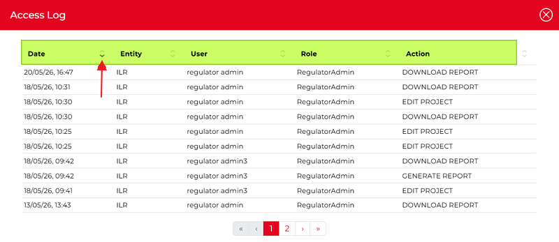

This allows you to see the earliest record at the top and follow, step by step, on which day which user (and in what role) performed what action on the selected report.

6.	Delete: you can delete the selected project by clicking this icon. A confirmation pop-up appears asking for your confirmation about the deletion:

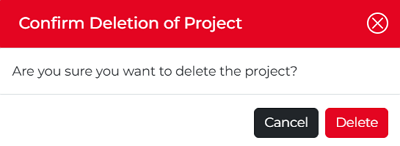

Once deleted, the project disappears from the Dashboard, and above the Dashboard, the text **The project has been deleted** is shown.

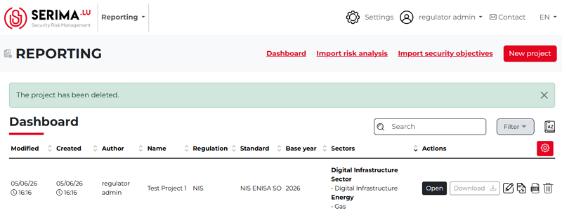

